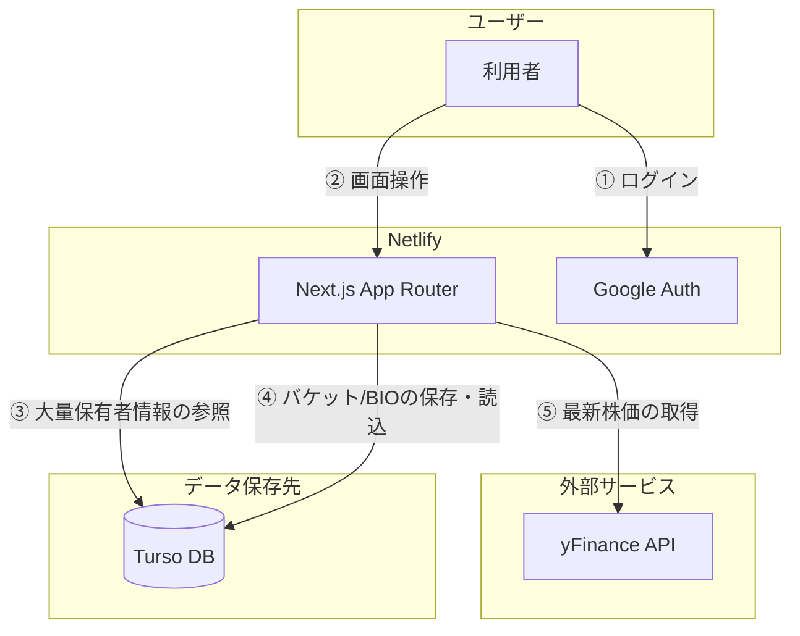
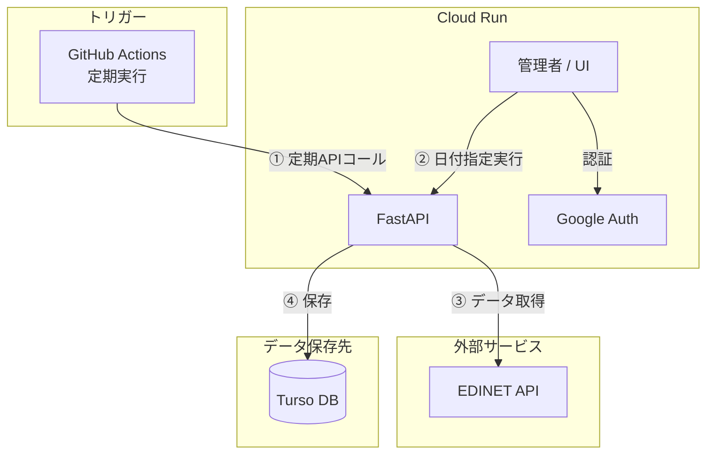

# Stock Whale Radar Frontend (FE)

## プロジェクト概要
「大量保有報告書」などのデータを解析し、大口投資家（クジラ）の動きを可視化・追跡するためのフロントサービスです。
バックエンド側で取得したデータを、表示するための画面です、
直観的に、情報集めらえるように株価などもYhooFinanceから入手すること
ログインした場合にはBucketsを管理できる
Bucketsには複数の銘柄をもち、それを一覧で確認できるようにする。

## 主な機能
- **ユーザー認証**: サインアップ、ログイン機能。GoogleAuthでのログイン
- **プロフィール管理**: メールアドレス、自己紹介の登録。
- **バケット管理**: 注目銘柄を「バケット」としてグループ化して管理。
- **大量保有情報閲覧**: 最新の大口保有データの表示、特定銘柄の履歴追跡。
- **ダッシュボード**: 保有数の変動が大きい銘柄や、最新のトレンドをサマリー表示。
- 利用者についてBIOやバケットの情報をメンテナンスできること
- バケット情報などはSQLite（Turso）にもつこと

## 構成


## 技術スタック
- **言語/フレームワーク**: TypeScript / NextJS
- **データベース**: SQLite (Turso) ※DBのマイグレーションはバックエンド側で管理するため、フロントエンド側でのマイグレーション実行は不要です。
- **デプロイ**: Netlify
- **CI/CD**: GitHub Actions

## ディレクトリ構成（予定）
```
src/
├── app/                          # Next.js App Router
│   ├── layout.tsx                # 全体レイアウト
│   ├── page.tsx                  # ホームページ
│   ├── page.tsx
│   ├── search/                   # Whale Lookup（統合検索）
│   ├── movements/                # クジラの動き
│   ├── buckets/                  #
│   ├── entity/
│   │   ├── holder/[id]/          # 投資家詳細
│   │   └── stock/[id]/           # 銘柄詳細
│   ├── admin/
│   │   ├── import-status/
│   │   └── import-history/
│   └── api/
├── components/                   # React コンポーネント
│   ├── layout/                   # レイアウトコンポーネント
│   ├── organisms/                # 複合コンポーネント
│   ├── pages/                    # ページロジックコンポーネント
│   └── ui/                       # shadcn/ui
├── constants/                    # 定数
├── content/help/                 # ヘルプに関するファイル 01_QuickStart.md 02_procy.md など
├── db/                           # データベース
│   └── schema/                   # Drizzle スキーマ定義
├── service/                      # ビジネスロジック層
├── lib/                          # 共通ライブラリ
└── type/                         # 型定義
```


## 仕様

* 仕様については[Spec](./docs/01_spec.md)に従うこと
* GoogleAuthについては[GoogleAuth](./docs/02_google_auth_migration_spec.md)に従うこと
* HelpSiteについては[HelpSite](./docs/03_help_site_migration_spec.md)に従うこと
* データの利用については、[API_DATA_MANAGEMENT](./docs/04_API_DATA_MANAGEMENT_SPEC.md)に従うこと。
* Schema(データベース構造)については[schema](./docs/21_schema.md)に従うこと
* 画面構成のデザインなどは[design](./docs/22_design.md)に従うこと
* 管理者で利用常用確認する画面は[Looker](./docs/41_LOOKER_STUDIO_INTEGRATION.md)に従うこと
* 株価のチャートの利用については[LightWeight](./docs/42_lightweight_charts_spec.md)を参照すること。

## stock-whale-radar-be（バックエンド）
### 目的
* EDINETから大量保有者情報を取得して、Turso（SQLite）にデータを登録する。
* 定期的にGithubActionからのAPIで呼び出される。
* すでに作成済みで今回のプロジェクトとは異なるものとする
* リリース先
  * [Github](https://github.com/sickboy0001/stock-whale-radar-be)
  * [デプロイ/ClourRun](https://stock-whale-radar-be-217119007226.asia-northeast1.run.app/)

### 構成
* Python + FastAPI
* CloudRun 
* Github（ACTION,CICD)
* SQLite（Turso）
* GoogleAuth

### 機能

* UIは最低限もつ
* GoogleAuthでのログイン
* 日付指定でのEDINETから大量保有者情報を取得する機能をもつ



## todo
- [ ] コメント入力できるようにする。データベースはZerosecへの登録を想定
- [ ] 履歴の登録（個人）（間近１週間、間近１か月、間近３か月）
- [ ] １日１回EdinetCode,FoundCodeを入手できるように(CloudRun（BackEnd）とGithubActionで実装する)
- [ ] Looker対応
- [x] Help対応FW調整
- [ ] Help対応コンテンツ見直し
- [x] 投資家情報を生成AIから入手→Gemini　仕様書 [ivestor_profile](docs/memo/20260508_ivestor_profile.md)
- [ ] 投資家情報を生成AIから入手→Gemini　実装
- [ ] 投資家情報の手修正
- [ ] プロファイル登録
- [ ] /activity　が異常な登録になってしまう。4259でなくE37158などで登録しないと無理なのかな。fi
- [x] GA4対応
- [x] 履歴の登録（全体）（間近１週間、間近１か月、間近３か月）
- [x] チャートの実装

## history
* 2026/4/30
  * https://irbank.net/E05376/share これ使えるかも
  * add ui dashboard whalemovement
* 2026/4/28
  * [deploy:netlify](https://stock-whale-radar-fe.netlify.app/)

